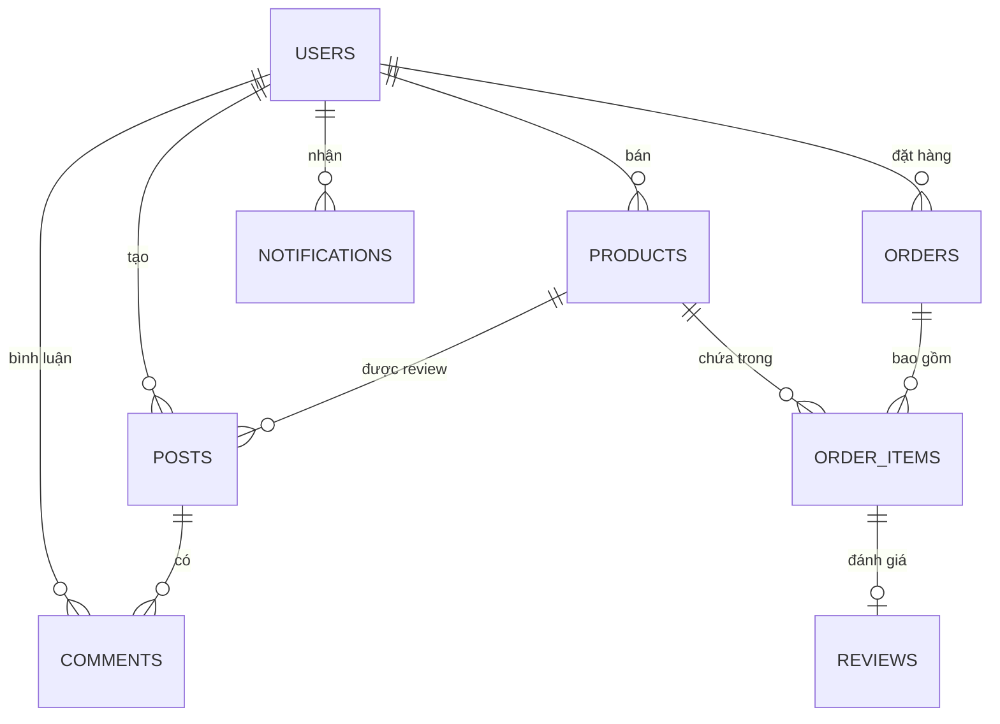
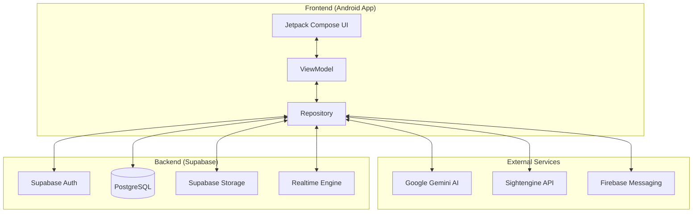

# Chương 3: Phân tích và thiết kế hệ thống

## 3.1. Phân tích yêu cầu

### 3.1.1. Yêu cầu chức năng (Functional Requirements)
Dựa trên việc phân tích các module trong source code (`com.example.smartpick.features`), hệ thống cung cấp các chức năng sau:

1.  **Hệ thống xác thực (Auth):**
    - Đăng ký tài khoản mới bằng Email.
    - Đăng nhập qua Email/Password hoặc Google Sign-In.
    - Quản lý trạng thái đăng nhập (Session) và tự động chuyển hướng.
2.  **Mạng xã hội mua sắm (Feed & Community):**
    - Xem bảng tin bài viết review (Video/Ảnh).
    - Thích (Like) bài viết với cơ chế Optimistic UI.
    - Bình luận (Comment) đa tầng (Reply comment).
    - Xem chi tiết bài viết và sản phẩm đi kèm.
    - Đăng bài viết mới kèm màng lọc kiểm duyệt AI.
3.  **Thương mại điện tử (E-commerce):**
    - Duyệt sản phẩm theo danh mục và tìm kiếm.
    - Xem chi tiết sản phẩm (Mô tả, giá, người bán, đánh giá).
    - Quản lý giỏ hàng (Thêm, sửa số lượng, xóa, chọn món thanh toán).
    - Thanh toán (Checkout): Nhập thông tin giao hàng và xác nhận đơn hàng.
    - Lịch sử đơn hàng: Theo dõi các đơn hàng đã mua.
    - Đánh giá sản phẩm (Review): Đánh giá sau khi mua hàng thành công.
4.  **Hỗ trợ thông minh (AI & Realtime):**
    - Chatbot AI Curator: Tư vấn sản phẩm và giải đáp thắc mắc.
    - Hệ thống thông báo (Notification): Nhận thông báo tương tác và đơn hàng thời gian thực qua FCM và Supabase Realtime.
5.  **Quản lý người bán (Seller):**
    - Dashboard thống kê doanh thu.
    - Quản lý sản phẩm đang bán.
    - Quản lý đơn hàng đã bán.

### 3.1.2. Yêu cầu phi chức năng (Non-functional Requirements)
- **Performance:** Ứng dụng phản hồi nhanh, media được load bất đồng bộ (Coil/ExoPlayer).
- **Security:** Bảo mật dữ liệu qua Supabase Row Level Security (RLS).
- **Usability:** Giao diện tuân thủ Material Design 3, hỗ trợ người dùng tối đa.
- **Reliability:** Xử lý ngoại lệ mạng và lỗi AI tốt, không gây treo ứng dụng.

## 3.2. Sơ đồ Use Case

```mermaid
usecaseDiagram
    actor "Người dùng" as User
    actor "Người bán" as Seller
    actor "Hệ thống AI" as AI

    package "Tài khoản" {
        User --> (Đăng ký/Đăng nhập)
        User --> (Cập nhật Profile)
    }

    package "Cộng đồng" {
        User --> (Xem Feed)
        User --> (Đăng bài Review)
        User --> (Like/Bình luận)
        (Đăng bài Review) ..> (Kiểm duyệt AI) : <<include>>
        AI --> (Kiểm duyệt AI)
    }

    package "Mua sắm" {
        User --> (Tìm kiếm sản phẩm)
        User --> (Quản lý giỏ hàng)
        User --> (Thanh toán đơn hàng)
        User --> (Đánh giá sản phẩm)
    }

    package "Tư vấn" {
        User --> (Chat với AI Curator)
    }

    package "Người bán" {
        Seller --> (Xem thống kê doanh thu)
        Seller --> (Quản lý sản phẩm/đơn hàng)
    }

    User <|-- Seller
```

## 3.3. Thiết kế Cơ sở dữ liệu (Database Design)

Phân tích từ hệ thống DTO và cấu trúc Database trên Supabase:

### 3.3.1. Sơ đồ thực thể quan hệ (ERD)



### 3.3.2. Các bảng dữ liệu chính
- **users:** `id, email, full_name, avatar_url, phone_number, created_at`
- **products:** `id, owner_id, name, price, stock, category, image_urls, video_url`
- **posts:** `id, user_id, product_id, content, media_urls`
- **orders:** `id, user_id, total_amount, shipping_address, status`
- **order_items:** `id, order_id, product_id, quantity, price_at_purchase`
- **notifications:** `id, user_id, type, content, is_read`

## 3.4. Kiến trúc hệ thống



## 3.5. Thiết kế API (Endpoints thực tế)

Hệ thống sử dụng cơ chế RESTful qua Supabase Postgrest:

| Method | Endpoint | Mô tả |
| :--- | :--- | :--- |
| POST | `/auth/v1/signup` | Đăng ký tài khoản |
| POST | `/auth/v1/token` | Đăng nhập lấy JWT |
| GET | `/rest/v1/posts` | Lấy danh sách bảng tin |
| POST | `/rest/v1/posts` | Tạo bài viết mới |
| POST | `/rest/v1/rpc/toggle_like` | Like/Unlike bài viết |
| GET | `/rest/v1/products` | Lấy danh sách sản phẩm |
| POST | `/rest/v1/orders` | Tạo đơn hàng mới |
| GET | `/rest/v1/notifications` | Lấy thông báo người dùng |

## 3.6. Kết luận chương
Chương này đã mô tả chi tiết thiết kế hệ thống SmartPick từ các yêu cầu chức năng đến cấu trúc dữ liệu và API. Sự kết hợp giữa kiến trúc MVVM ở phía Client và nền tảng BaaS Supabase tạo ra một hệ thống linh hoạt, có khả năng mở rộng tốt.
