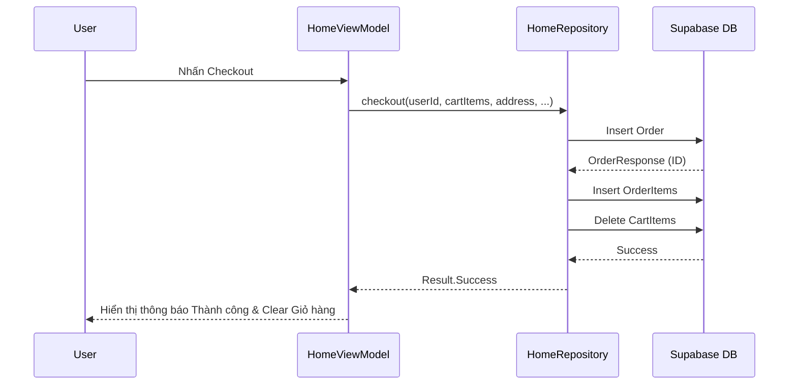

# Chương 3: Phân tích và Thiết kế hệ thống

## 3.1. Phân tích yêu cầu

### 3.1.1. Yêu cầu chức năng
- **Người dùng:** Đăng ký, đăng nhập, cập nhật hồ sơ, đổi mật khẩu.
- **Cộng đồng:** Đăng bài viết (ảnh/video), like, bình luận, reply bình luận.
- **Thương mại:** Tìm kiếm sản phẩm, xem chi tiết, thêm vào giỏ hàng, đặt hàng, xem lịch sử mua hàng, đánh giá sản phẩm đã mua.
- **AI & An toàn:** Chat với trợ lý ảo, tự động kiểm duyệt nội dung bài đăng.
- **Thông báo:** Nhận thông báo realtime về các tương tác.

### 3.1.2. Yêu cầu phi chức năng
- **Tính khả dụng:** Giao diện trực quan, dễ sử dụng, tuân thủ Material Design 3.
- **Hiệu năng:** Thời gian phản hồi API < 2s, cuộn danh sách mượt mà (60fps).
- **Tính bảo mật:** Dữ liệu người dùng được mã hóa, phân quyền RLS chặt chẽ.
- **Tính ổn định:** Xử lý tốt các trường hợp mất kết nối hoặc lỗi server.

## 3.2. Thiết kế Use Case

```mermaid
usecaseDiagram
    actor "Người dùng" as U
    actor "Hệ thống AI" as AI
    
    package "SmartPick System" {
        usecase "Đăng ký/Đăng nhập" as UC1
        usecase "Đăng bài chia sẻ" as UC2
        usecase "Tương tác (Like/Comment)" as UC3
        usecase "Mua sắm & Thanh toán" as UC4
        usecase "Tư vấn với Chatbot" as UC5
        usecase "Kiểm duyệt nội dung" as UC6
    }
    
    U --> UC1
    U --> UC2
    U --> UC3
    U --> UC4
    U --> UC5
    
    UC2 ..> UC6 : <<include>>
    AI --> UC6
    AI --> UC5
```

## 3.3. Thiết kế luồng dữ liệu (Activity Diagram)
### Luồng Đăng bài viết

```mermaid
activityDiagram
    start
    :Người dùng chọn ảnh/video;
    :Nhập nội dung và thông tin sản phẩm;
    :Nhấn nút Đăng;
    fork
        :AI kiểm duyệt văn bản;
    fork again
        :AI kiểm duyệt hình ảnh;
    end fork
    if (Nội dung hợp lệ?) then (Có)
        :Upload Media lên Storage;
        :Lưu dữ liệu vào Database;
        :Hiển thị bài viết lên Feed;
        stop
    else (Không)
        :Hiển thị thông báo vi phạm;
        :Yêu cầu chỉnh sửa;
        detach
    endif
```

## 3.4. Sequence Diagram (Luồng Mua hàng)



## 3.5. Thiết kế Cơ sở dữ liệu (ERD)
Hệ thống sử dụng cơ sở dữ liệu quan hệ với các ràng buộc khóa ngoại (Foreign Keys) để đảm bảo tính nhất quán giữa `users`, `products`, `posts`, `orders` và `reviews`. Chi tiết sơ đồ đã được trình bày trong file `DATABASE.md`.
