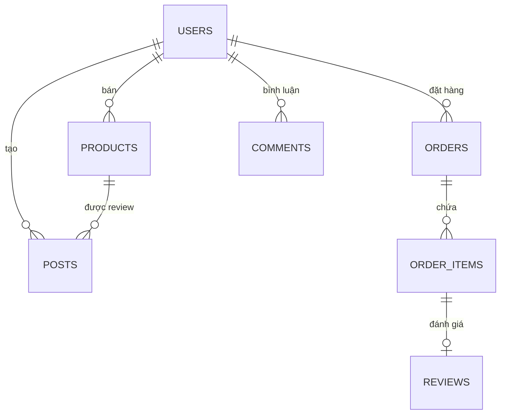

# BÁO CÁO XÂY DỰNG HỆ THỐNG MẠNG XÃ HỘI MUA SẮM THÔNG MINH SMARTPICK

**Học phần:** Phát triển ứng dụng di động nâng cao
**Hệ thống:** SmartPick (Social Commerce with AI)

---

## MỤC LỤC

1. [Chương 1: Đặt vấn đề](#chương-1-đặt-vấn-đề)
2. [Chương 2: Công nghệ sử dụng](#chương-2-công-nghe-su-dung)
3. [Chương 3: Phân tích và thiết kế hệ thống](#chương-3-phan-tich-va-thiết-kế-hệ-thống)
4. [Chương 4: Đánh giá và kiểm thử](#chương-4-danh-gia-va-kiểm-thử)
5. [Kết luận](#kết-luận)

---

## Chương 1: Đặt vấn đề

### 1.1. Bối cảnh thực tế
Trong kỷ nguyên công nghiệp 4.0, hành vi mua sắm của người tiêu dùng đã có sự thay đổi mạnh mẽ. Mô hình Thương mại điện tử truyền thống đang dần chuyển dịch sang "Social Commerce" (Thương mại xã hội), nơi các quyết định mua hàng bị ảnh hưởng lớn bởi các nội dung đánh giá (review), chia sẻ trải nghiệm thực tế trên các mạng xã hội. Tuy nhiên, sự tách biệt giữa nền tảng nội dung và nền tảng giao dịch tạo ra sự đứt gãy trong trải nghiệm khách hàng.

### 1.2. Mục tiêu hệ thống
Phát triển ứng dụng Android **SmartPick** - một hệ sinh thái Social Commerce toàn diện, tích hợp AI để tối ưu hóa hành trình mua sắm:
- Tích hợp mạng xã hội chia sẻ review (Video/Ảnh) và thương mại điện tử.
- Sử dụng AI để kiểm duyệt nội dung tự động và tư vấn sản phẩm thông minh.
- Đảm bảo tính an toàn và minh bạch trong cộng đồng mua sắm.

### 1.3. Đối tượng sử dụng
- **Người dùng (Buyer):** Tìm kiếm review thực tế, mua hàng và nhận tư vấn AI.
- **Người bán (Seller):** Quản lý gian hàng, sản phẩm và theo dõi doanh thu qua Dashboard.
- **Khách (Guest):** Tiếp cận thông tin ứng dụng trước khi định danh.

---

## Chương 2: Công nghệ sử dụng

Hệ thống được xây dựng trên nền tảng Android Native với kiến trúc hiện đại:

| Thành phần | Công nghệ / Thư viện |
| :--- | :--- |
| **Ngôn ngữ** | Kotlin 2.0 (JVM 17) |
| **UI Framework** | Jetpack Compose (Material Design 3) |
| **Kiến trúc** | MVVM + Clean Architecture |
| **Dependency Injection** | Hilt (Dagger) |
| **Backend (BaaS)** | Supabase (Auth, DB, Storage, Realtime) |
| **Xử lý mạng** | Ktor Client & OkHttp |
| **Trí tuệ nhân tạo** | Google Gemini (LLM), Sightengine (Image Moderation) |
| **Media** | Media3 ExoPlayer (Video), Coil (Image) |
| **Thông báo** | Firebase Cloud Messaging (FCM) |

---

## Chương 3: Phân tích và thiết kế hệ thống

### 3.1. Phân tích yêu cầu chức năng
- **Module Auth:** Đăng nhập Email/Google, quản lý session.
- **Module Cộng đồng:** Feed video/ảnh, Like (Optimistic UI), Comment đa tầng.
- **Module Thương mại:** Giỏ hàng, Checkout, Lịch sử mua hàng, Đánh giá sản phẩm.
- **Module AI:** Chatbot tư vấn Curator, AI Moderation (Màng lọc nội dung xấu).
- **Module Seller:** Dashboard thống kê doanh thu và quản lý kho.

### 3.2. Sơ đồ thực thể quan hệ (ERD)

### 3.3. API Design
Hệ thống sử dụng cơ chế RESTful tự động từ Supabase:
- `GET /rest/v1/posts`: Lấy bảng tin theo thời gian thực.
- `POST /rest/v1/rpc/toggle_like`: Xử lý logic Like bài viết.
- `POST /rest/v1/orders`: Tạo đơn hàng và trừ kho tự động.

---

## Chương 4: Đánh giá và kiểm thử

### 4.1. Chiến lược kiểm thử
Dự án thực hiện Unit Test toàn diện cho tầng ViewModel và Service bằng JUnit 4, MockK và Turbine.

### 4.2. Các kịch bản kiểm thử chính
1. **Kiểm duyệt AI:** Đăng bài có nội dung độc hại (Text/Image) -> Hệ thống chặn thành công.
2. **Logic Giỏ hàng:** Tăng số lượng quá tồn kho -> Hiển thị cảnh báo lỗi.
3. **Optimistic UI:** Like bài viết cập nhật UI ngay lập tức trước khi server phản hồi.
4. **Tài chính:** Tính toán doanh thu tại Seller Dashboard chính xác theo giá tại thời điểm mua.

### 4.3. Đánh giá hệ thống
- **Ưu điểm:** Kiến trúc sạch, an toàn nội dung tuyệt đối nhờ AI, trải nghiệm mượt mà.
- **Hạn chế:** Phụ thuộc vào kết nối Internet và chi phí API AI.

---

## Kết luận

Hệ thống **SmartPick** đã hoàn thiện các chức năng cốt lõi của một nền tảng Social Commerce hiện đại. Việc ứng dụng AI vào kiểm duyệt và tư vấn không chỉ tăng tính an toàn mà còn nâng cao trải nghiệm mua sắm cá nhân hóa. Trong tương lai, hệ thống sẽ mở rộng thêm các phương thức thanh toán điện tử và Livestream bán hàng.

---
**Nhóm thực hiện dự án SmartPick**
Cập nhật: 2024
