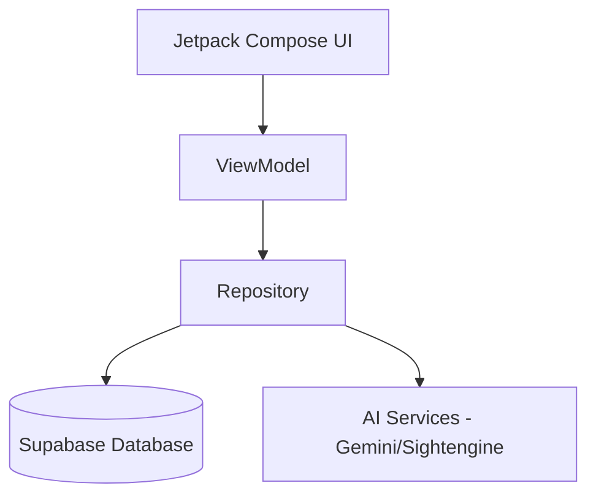

# BÁO CÁO TỔNG KẾT DỰ ÁN SMARTPICK

## MỤC LỤC
1. [Giới thiệu dự án](#1-giới-thiệu-dự-án)
2. [Phân tích yêu cầu](#2-phân-tích-yêu-cầu)
3. [Kiến trúc hệ thống](#3-kiến-trúc-hệ-thống)
4. [Công nghệ sử dụng](#4-công-nghệ-sử-dụng)
5. [Thiết kế chi tiết](#5-thiết-kế-chi-tiết)
6. [Đánh giá và Kiểm thử](#6-đánh-giá-và-kiểm-thử)
7. [Kết luận và Hướng phát triển](#7-kết-luận-và-hướng-phát-triển)

---

## 1. Giới thiệu dự án
SmartPick là ứng dụng Android được thiết kế nhằm xây dựng một cộng đồng chia sẻ trải nghiệm sản phẩm trung thực. Khác với các sàn thương mại điện tử thuần túy, SmartPick tập trung vào yếu tố "Social" và "AI" để giúp người dùng đưa ra quyết định mua sắm đúng đắn nhất.

- **Bối cảnh:** Sự bùng nổ của thương mại điện tử đi kèm với vấn nạn đánh giá ảo và nội dung không lành mạnh.
- **Mục tiêu:** Tạo môi trường chia sẻ sạch, an toàn và thông minh nhờ tích hợp AI.

## 2. Phân tích yêu cầu
- **Chức năng chính:**
    - Hệ thống tài khoản và bảo mật (Google Sign-In).
    - Bảng tin (Feed) hỗ trợ đa phương tiện (Ảnh/Video).
    - Giỏ hàng và quy trình thanh toán (Checkout).
    - Hệ thống đánh giá (Reviews) có xác thực mua hàng.
    - Trợ lý tư vấn AI (Gemini Chatbot).
- **Yêu cầu phi chức năng:**
    - Tự động kiểm duyệt nội dung (Moderation).
    - Đồng bộ dữ liệu thời gian thực (Realtime).
    - Giao diện hiện đại (Material Design 3).

## 3. Kiến trúc hệ thống
Ứng dụng tuân thủ kiến trúc **Clean Architecture** kết hợp mô hình **MVVM**:
- **Presentation:** Jetpack Compose & ViewModel.
- **Domain/Data:** Repositories quản lý luồng dữ liệu từ Supabase.
- **Core:** Chứa Moderation Service và Network Module dùng chung.

## 4. Công nghệ sử dụng
- **Android SDK:** Kotlin, Jetpack Compose, Hilt, Coroutines.
- **Backend:** Supabase (Auth, DB, Storage, Realtime).
- **AI Integration:** Google Gemini 1.5 Flash & Sightengine API.
- **Media:** ExoPlayer (Video), Coil (Image).

## 5. Thiết kế chi tiết
### 5.1. Cơ sở dữ liệu
Hệ thống sử dụng PostgreSQL với các bảng chính: `users`, `products`, `posts`, `orders`, `order_items`, `reviews`.
Cơ chế **Row Level Security (RLS)** được áp dụng để bảo vệ dữ liệu người dùng.

### 5.2. Luồng hoạt động quan trọng
- **Kiểm duyệt nội dung:** Mọi bài đăng đều được quét song song bởi 2 AI trước khi lưu vào database.
- **Xác thực mua hàng:** Người dùng chỉ được viết đánh giá sau khi đơn hàng chuyển sang trạng thái `completed`.

## 6. Đánh giá và Kiểm thử
- **Đã kiểm thử:** Chức năng đăng nhập, đăng bài, giỏ hàng, và các ca chặn nội dung độc hại.
- **Hiệu năng:** Ứng dụng hoạt động mượt mà, load media nhanh nhờ cơ chế Caching của Coil và Ktor.
- **Đánh giá UX:** Giao diện trực quan, luồng mua hàng ngắn gọn (3 bước).

## 7. Kết luận và Hướng phát triển
Dự án SmartPick đã hoàn thiện các mục tiêu đề ra ban đầu, tích hợp thành công AI vào thực tế nghiệp vụ.
**Hướng phát triển:**
- Tích hợp thanh toán điện tử (Momo/VNPay).
- Hệ thống gợi ý sản phẩm thông minh.
- Phiên bản iOS sử dụng Kotlin Multiplatform.

---
*SmartPick Team - 2024*
